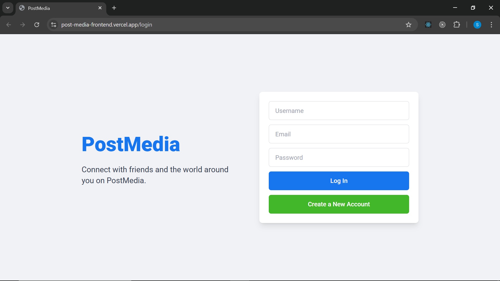
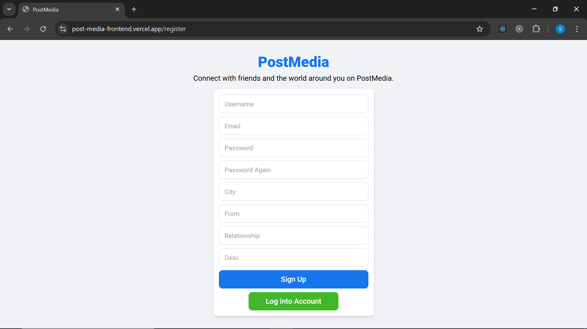
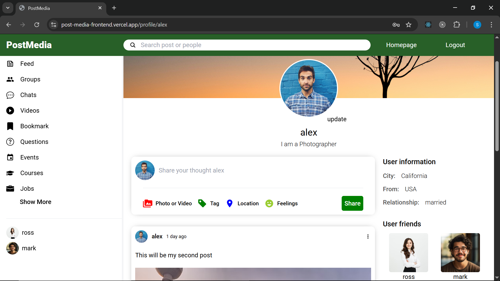
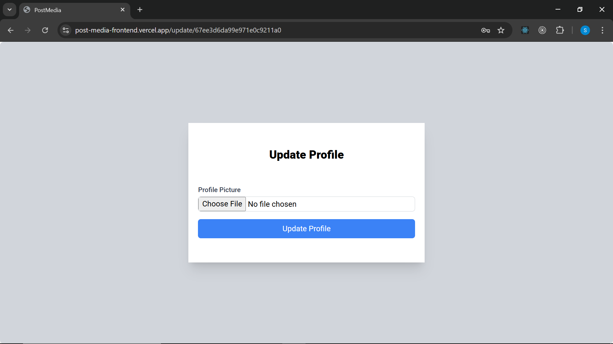

# PostMedia - A Social Media Web App 📝📸

## Overview  
PostMedia is a full-stack social media web application where users can create posts with text and images, like posts, follow other users, and manage their own profiles. The app features authentication, profile viewing, Cloudinary image uploads, and real-time UI updates — all built with the MERN stack.

## Live Website  
🔗 [Deployed on Vercel](https://your-postmedia-frontend.vercel.app)

## Features  
- [x] User authentication (Register / Login / Logout)
- [x] Create posts with text and image (uploaded to Cloudinary)
- [x] Like/unlike posts
- [x] Follow and unfollow other users
- [x] View other users’ profiles and their posts
- [x] Update profile picture (uploaded to Cloudinary)
- [x] Protected routes (based on React Context API)
- [x] Responsive and clean UI

## Tech Stack  
- **Frontend:** React.js (Vite), Tailwind CSS, React Router, Context API  
- **Backend:** Node.js, Express.js, MongoDB, Mongoose  
- **Image Storage:** Cloudinary  
- **Deployment:** Vercel (frontend & backend)

## Screenshots  
### Home Page  

### Login Page  

### Register Page  

### Profile Page  

### Create Post  

### Edit Profile Picture  

### 404 Page  
